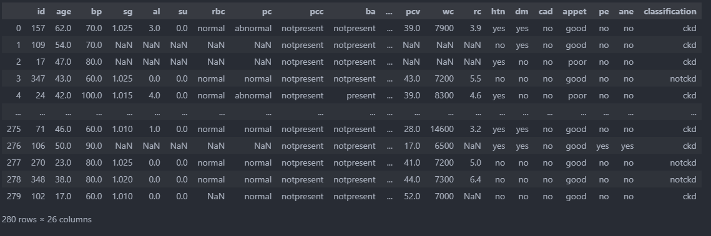
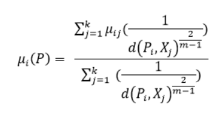
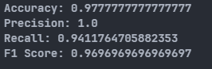

# Chronic Kidney Disease Prediction using Fuzzy K-Nearest Neighbors algorithm

## Overview :
This project aims to develop a machine learning model for predicting chronic kidney disease (CKD) using the Fuzzy K-Nearest Neighbors (Fuzzy KNN) algorithm. Chronic kidney disease is a significant health concern globally, and early detection plays a crucial role in effective management and treatment. Machine learning techniques, particularly Fuzzy KNN, offer a promising approach for accurate prediction.

## Requirements :
- numpy
- pandas
- matplotlib
- seaborn
- scikit-learn
- scipy

## Dataset : 
### Dataset Source : [Kaggle](https://www.kaggle.com/datasets/colearninglounge/chronic-kidney-disease?resource=download)

| Attribute Name | Actual Name | Attribute Name | Actual Name | 
| ------------- | ------------- | ------------- | ------------- |
| age | Age | sod | sodium |
| bp | blood pressure | pot | potassium |
| sg | specific gravity | hemo | hemoglobin |
| al | albumin | pcv | packed cell volume |
| su | sugar | wc | white blood cell count |
| rbc | red blood cells | rc | red blood cell count |
| pc | pus cell  | htn | hypertension |
| pcc | pus cell clumps | dm | diabetes mellitus |
| ba | bacteria  | cad | coronary artery disease |
| bgr | blood glucose random   | appet | appetite |
| bu |blood urea  | pe | pedal edema |
| sc | serum creatinine  | ane | anemia |
| pcc | pus cell clumps  | class | class |

## Methodology:
1. Data Preprocessing: Cleaning the dataset, Changing Attribute Name, handling missing values, and encoding categorical & nominal.
2. Feature Selection: Identifying relevant features that contribute significantly to the prediction of CKD.
3. Model Training: Implementing the Fuzzy k-NN algorithm.
4. Model Evaluation: Assessing the performance of the model using appropriate metrics such as accuracy, precision, recall, and F1-score.

## Preview
### Dataset Preview

### Fuzzy K-Nearest Neighbors Formula & Accuracy Result
 

## Usage
1. Clone the repository :
```` Git
git clone https://github.com/DikkiKartajaya/ChronicKidneyDisease-FuzzyKNN.git
````
2. Install the required dependencies :
```` Python
pip install -r requirement.txt
````
3. Run the Jupyter notebook Kidneydisease_FuzzyKNN.ipynb to train and evaluate the Fuzzy KNN model.

## Contribution :
Contributions to the project are welcome! If you have any suggestions for improvement, feature requests, or bug reports, please feel free to open an issue or submit a pull request.
